# Attack Defense Lab
## Privilege Escalation I (AppArmor)

**Important Note** : This document illustrates all the important steps required to complete this lab. This  is  by no  means  a  comprehensive  step-by-step  solution for this exercise.  This  is only provided as a reference to various commands needed to complete this exercise and for your further  research on this topic. Also,  note that the IP addresses and domain names might be different in your lab.


The student user access is provided on a Docker host. The Docker daemon is using a TCP socket and only restricted functionality is exposed to non-root users. The AppArmor profiles are also deployed to confine the containers. The flag is kept in the home directory of the root user of the Docker host.

### Objective :  Elevate access and retrieve the flag!  
### Solution :

**Step 1**: Check the sudo privileges granted to the user.  
Command: `sudo -l`  
  


**Step 2**:  Check the listening sockets on the machine.  
Command: `netstat -tlpn`  

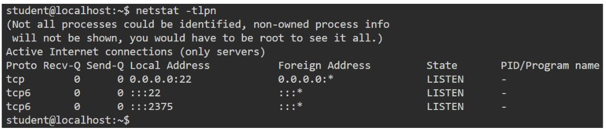  

**Step 3**:  It is mentioned in the challenge statement that Docker daemon is listening on TCP port. Port 22 belongs to the SSH server so the Docker socket is running on TCP port 2375. Set **DOCKER HOST** variable  
Command: `export DOCKER_HOST=localhost:2375`
  
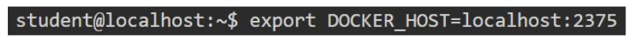  
  
**Step 4**:​ List the containers running on the host.  
Command:​ `docker ps`  
  
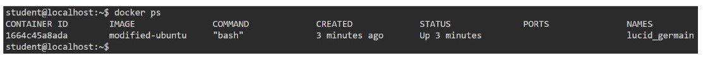 
  
**Step 5**:​ Open another terminal (T2) and run tail on audit.log file. Also apply a filter to only viewapparmor logs.  
Command:​ `sudo /usr/bin/tail -f /var/log/audit/audit.log | grep apparmor`  
  
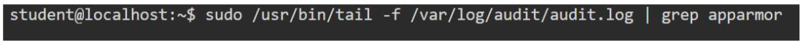  
  
**Step 6**:​ After trying to perform various operations on the docker, eventually it will be clear thatonly exec command is allowed by custom docker firewall. So, exec into the running container.  
Command:​ `docker exec -it 1664c45a8ada bash`  
  
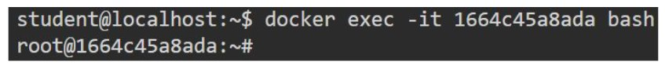  


**Step 7**:​ Check the capabilities granted to the Docker container.  
Command:​ `capsh --print`  
  
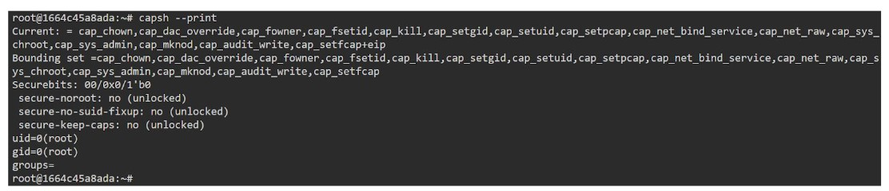  
  
The container has multiple capabilities but mainly also has **SYS_ADMIN** capability that allowsthe user to perform multiple privileged operations.  
  
**Step 8**:​ Check the storage devices (disks) available on this machine.  
Command:​ `fdisk -l`  

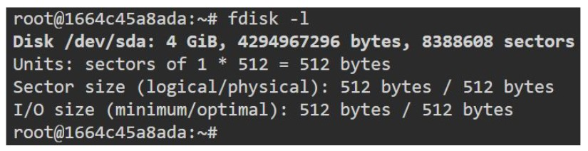
    
One can observe that a disk of the host is attached to the container and is mounted at `/dev/sda`.  

**Step 9**:​ Try to mount it on /tmp directory.  
Command:​ `mount /dev/sda  /tmp/`  

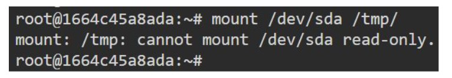   
  
The attempt failed. As the container had the capability to perform this action, this is highly likelythat the apparmor has blocked this action.  

**Step 10​**: Check the logs appearing from `audit.log` file in terminal T2.  

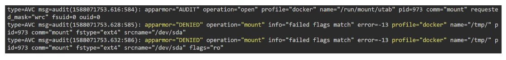   

It is clear from the logs that apparmor has denied the mount operation for `docker` profile.  

**Step 11**:​ Change to apparmor profile directory and open the docker profile file using vim.  
Commands:  
```
cd /etc/apparmor.d/
sudo vim docker
```  
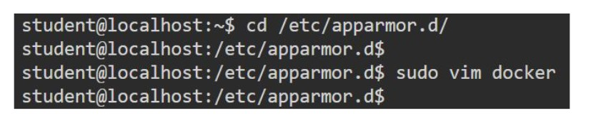   
  
In the profile file, the mount operation is denied.  

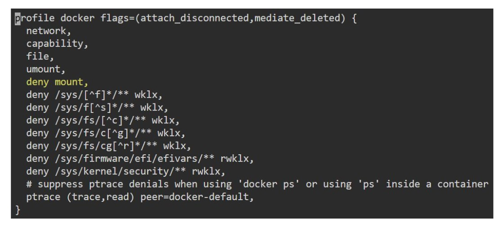   

Remove the `deny` string from the line. So, after modification the profile should appear asshown in the screenshot below :  

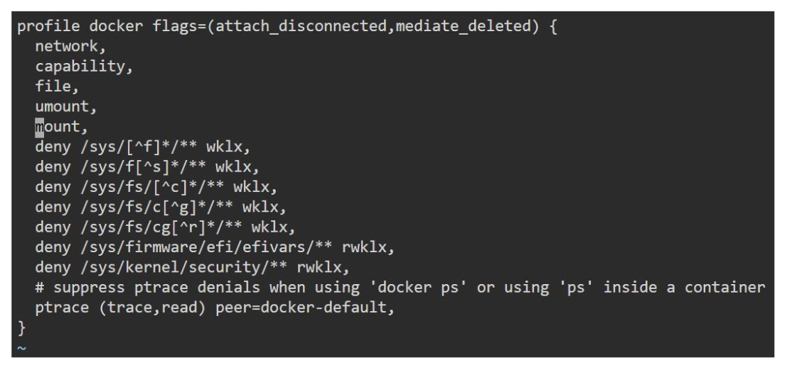   

**Step 12**:​ Reload the apparmor profile.  
Command:​ `sudo apparmor_parser -r docker`  

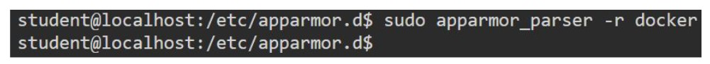   
  
**Step 13**:​ Now try to mount the disk again.  
Command:​ `mount /dev/sda /tmp/`  

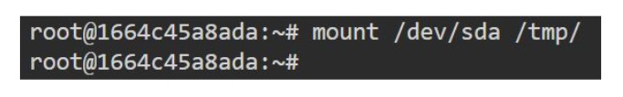   
  
This time the operation succeeded.  

**Step 14**:​ Retrieve the flag from the home directory of the root user.  
Command: `​cat /tmp/root/flag`  

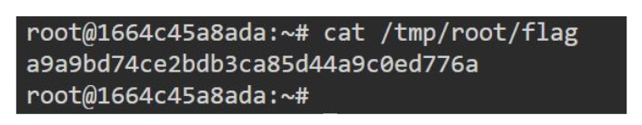   

Flag: `​a9a9bd74ce2bdb3ca85d44a9c0ed776a` 

References:  
● AppArmor man page(​http://manpages.ubuntu.com/manpages/bionic/man7/apparmor.7.html​)(​http://manpages.ubuntu.com/manpages/bionic/man5/apparmor.d.5.html​)  
  
● Beginning AppArmor profile development(​https://ubuntu.com/tutorials/beginning-apparmor-profile-development​)  
 

